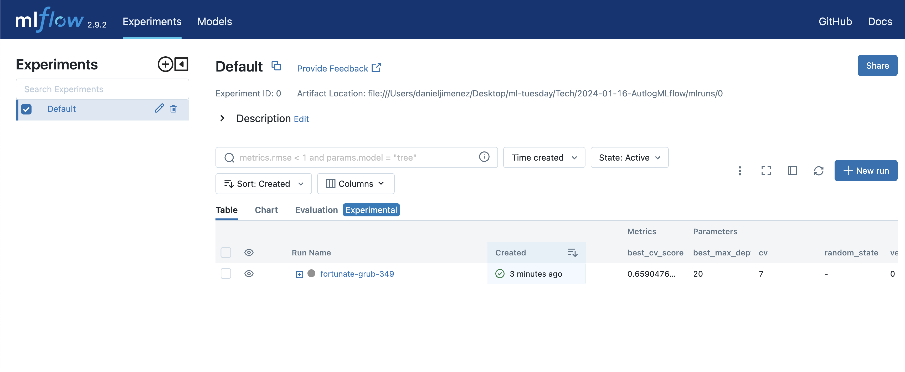
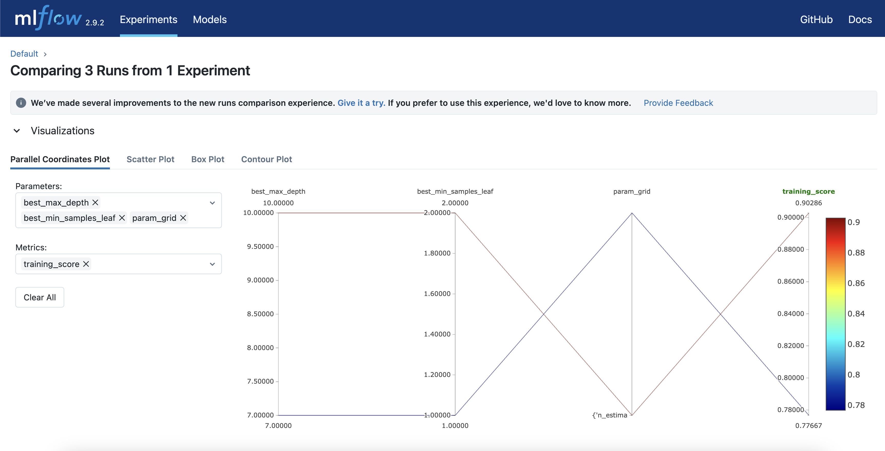

## Autolog with MLflow

The purpose of this post is to understand the operation of MLflow's Autolog, based on the publication called [Automatic Metric, Parameter, and Artifact Logging with mlflow.autolog.](https://mlflow.org/blog/2023/11/30/using-autolog/index.html) by Daniel Liden

Before diving into the details, in order to create the environment, from the terminal and from the same path where the conda.yml file is located, run the following command:

``` bash
conda env create -f conda.yml  
```

Once the environment is installed, activate it using the following command:

``` bash
conda activate autolog_mlflow 
```

To run the code containing the Python script from the terminal, execute the following command:

``` bash
python 2024-01-16-autologMLflow.py
```

To finish, run the MLflow graphical interface:

``` bash
mlflow ui
```




Now, let's understand what is happening with MLflow's Autolog.

The main idea behind Autolog in MLflow is to provide a track of experiments. In this track, you can detail:

* Metrics
* Model parameters
* Artifacts

MLflow automatically provides this logger, which enables the formulation of architecture hypotheses for the model. With this, you can register the model and use it once the hypotheses and architecture match.

In the code that can be viewed (click on the code to see it in full), MLflow is initialized with a grid to find the best model parameter:


``` python
with mlflow.start_run():
    # Initialize the GridSearchCV object
    clf = GridSearchCV(
        estimator=RandomForestClassifier(random_state=42),
        param_grid=param_grid,
        cv=5
    )
```


Each track is registered, and Autolog successfully logs it.

As a result, the following is printed in the console:

``` python
run = mlflow.active_run()
    run_id = run.info.run_id
    print(f"Run ID: {run_id}")

    # Fetch the run details
    run_details = mlflow.get_run(run_id)
``` 


Finally, after experimenting with the grid parameters, MLflow records each interaction and visually allows for model comparisons to reach a conclusion.



